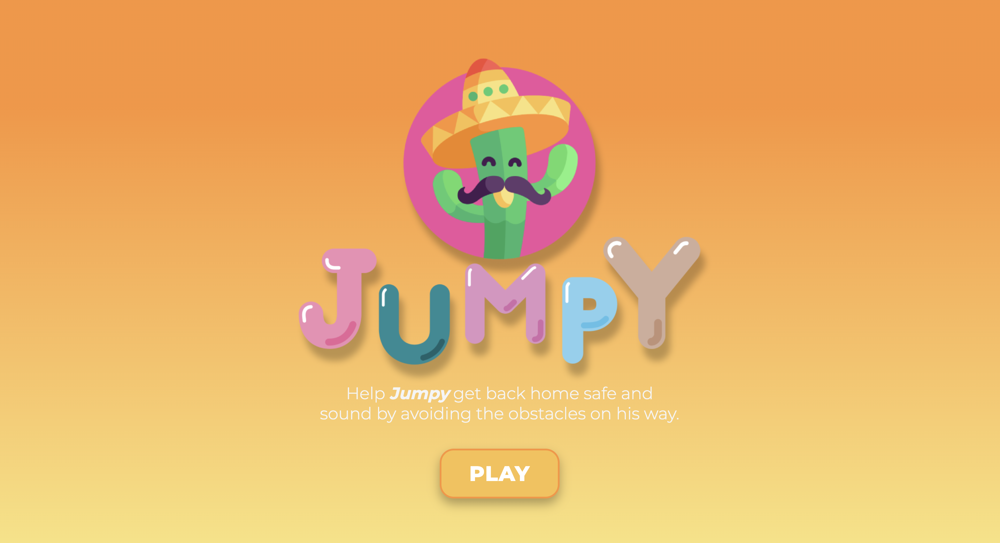
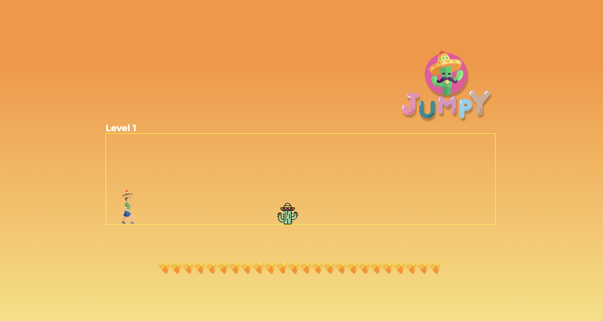

# Jumpy Game 🌵

## What is it?

[Jumpy](https://mgrajez.github.io/Project-1/) is your favourite T-Rex game from Google Chrome with a refreshed look and a new theme. Let's go to Mexico!

This game was my first project after joining the Web Development bootcamp at IRONHACK Paris.

---

## Functionality

Just press the **spacebar** to jump through obstacles and help Jumpy get back home.

---

## Tech stack

- Javascript (ES18)
- HTML
- CSS

---

## Play it!

[Play the game here](https://mgrajez.github.io/Project-1/)
